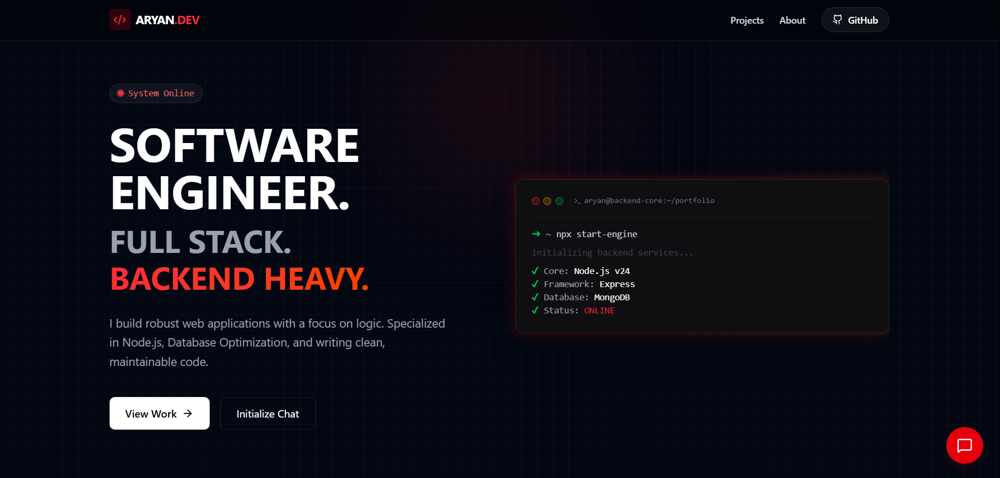

# ⚡ System ARC | Aryan Pandey

> "I architect scalable systems that don't crash."

A high-performance, dark-themed portfolio designed for a System Architect. Built with a "function-over-form" philosophy, featuring a terminal-inspired interface, AI-powered chat assistance, and dynamic content synchronization via GitHub's GraphQL API.



## 🏗 Architecture & Tech Stack

This project runs as a hybrid app: a **Vite/React frontend** served alongside an **Express backend** (for API proxying and AI logic), deployable as a serverless function on Vercel.

### **Frontend (The Terminal)**
- **Core:** React 19, Vite
- **Styling:** TailwindCSS v4 (Oxide engine), Framer Motion (Animations)
- **Icons:** Lucide React
- **Theme:** "System Dark" (#050505 background with #dc2626 accents)

### **Backend (The Core)**
- **Runtime:** Node.js / Express
- **AI Integration:** Google Gemini 2.5 Flash (via `@google/generative-ai`)
- **Data Sync:** GitHub GraphQL API (Automatic project fetching)
- **Notifications:** Telegram Bot API (Instant lead alerts)

## 🚀 Key Features

1.  **Dynamic Project Sync:**
    - The portfolio fetches data directly from my GitHub profile.
    - **Featured Projects:** Fetched from "Pinned" repositories.
    - **Latest Activity:** Fetched from recently pushed repositories.
    - **Tech Stack Tags:** Mapped directly from GitHub Repository Topics.
2.  **System ARC Bot:**
    - A context-aware chatbot powered by Gemini AI.
    - Acts as a bridge between the visitor and my resume.
    - Captures leads and forwards them to a private Telegram channel.
3.  **Bento Grid Analytics:**
    - A modular grid displaying skills, philosophy, and stats.

## 🛠️ Local Installation

1.  **Clone the System:**
    ```bash
    git clone [https://github.com/ImAryanPandey/portfolio.git](https://github.com/ImAryanPandey/portfolio.git)
    cd portfolio
    ```

2.  **Install Dependencies:**
    ```bash
    pnpm install
    ```

3.  **Configure Environment:**
    Create a `.env` file in the root directory:
    ```env
    # GitHub Token (Must have 'read:user' scope)
    GITHUB_TOKEN=your_github_pat_here

    # Gemini AI (Get from Google AI Studio)
    GEMINI_API_KEY=your_gemini_key_here

    # Telegram (For lead notifications)
    TELEGRAM_BOT_TOKEN=your_bot_token
    TELEGRAM_CHAT_ID=your_chat_id
    ```

4.  **Initialize System:**
    ```bash
    # Runs Vite Frontend + Express Backend proxy
    pnpm run dev
    ```

## ⚙️ Repository Configuration (Important)

For the **Projects Section** to work correctly, every repository on my GitHub (including this one) follows this metadata structure:

* **Description:** Displayed as the project summary.
* **Website (Homepage):** Used for the "Live Demo" button.
* **Topics (Tags):** Used to generate the Tech Stack chips (e.g., `react`, `nodejs`, `mongodb`).
* **Social Preview (Open Graph):** Used as the project card background image.

## 📄 License

© 2026 Aryan Pandey. All Rights Reserved.